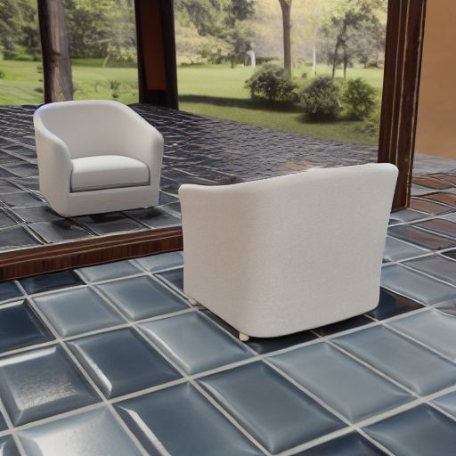

<div align="center">

<h1>Reflecting Reality: Enabling Diffusion Models to Produce Faithful Mirror Reflections</h1>

<p align="center">
    <a href="https://www.linkedin.com/in/ankit-dhiman-46109a174/" target="_blank"><strong>Ankit Dhiman</strong></a> <sup>1,2<b>*</b></sup>
    ·
    <a href="https://cs-mshah.github.io/" target="_blank"><strong>Manan Shah</strong></a> <sup>1<b>*</b></sup>
    ·
    <a href="https://rishubhpar.github.io/" target="_blank"><strong>Rishubh Parihar</strong></a> <sup>1</sup>
    ·
    <a href="https://yashbhalgat.github.io/" target="_blank"><strong>Yash Bhalgat</strong></a> <sup>3</sup>
    ·
    <strong>Lokesh R Boregowda</strong>
    ·
    <a href="https://cds.iisc.ac.in/faculty/venky/" target="_blank"><strong>R Venkatesh Babu</strong></a> <sup>1</sup>
</p>
<p align="center" style="padding-top: 0px;">
    <sup><b>*</b></sup> Equal Contribution
    <br>
    <sup>1</sup> Vision and AI Lab, IISc Bangalore
    <br>
    <sup>2</sup> Samsung R & D Institute India - Bangalore
    <br>
    <sup>3</sup> Visual Geometry Group, University of Oxford
    <br>
</p>

<a href="https://arxiv.org/abs/2409.14677">
</a>
<a href="https://val.cds.iisc.ac.in/reflecting-reality.github.io/">
</a>
<br>


</div>

## 🗓️ TODO
- [ ] Release the dataset
- [ ] Release the training, inference and evaluation codes
- [ ] Release the checkpoints
- [X] [24/9/2024] 🔥 Release the [paper](https://arxiv.org/abs/2409.14677) and [project page](https://val.cds.iisc.ac.in/reflecting-reality.github.io/)

## 📖 Abstract

We tackle the problem of generating highly realistic and plausible mirror reflections using diffusion-based generative models. We formulate this problem as an image inpainting task, allowing for more user control over the placement of mirrors during the generation process. To enable this, we create **SynMirror**, a large-scale dataset of diverse synthetic scenes with objects placed in front of mirrors. **SynMirror** contains around $198K$ samples rendered from $66K$ unique 3D objects, along with their associated depth maps, normal maps and instance-wise segmentation masks, to capture relevant geometric properties of the scene. Using this dataset, we propose a novel depth-conditioned inpainting method called **MirrorFusion**, which generates high-quality geometrically consistent and photo-realistic mirror reflections given an input image and a mask depicting the mirror region. **MirrorFusion** outperforms state-of-the-art methods on **SynMirror**, as demonstrated by extensive quantitative and qualitative analysis. To the best of our knowledge, we are the first to successfully tackle the challenging problem of generating controlled and faithful mirror reflections of an object in a scene using diffusion based models. **SynMirror** and **MirrorFusion** open up new avenues for image editing and augmented reality applications for practitioners and researchers alike.

## 🤝🏼 Cite Us

```
@article{Dhiman2024Sep,
	author = {Dhiman, Ankit and Shah, Manan and Parihar, Rishubh and Bhalgat, Yash and Boregowda, Lokesh R. and Babu, R. Venkatesh},
	title = {{Reflecting Reality: Enabling Diffusion Models to Produce Faithful Mirror Reflections}},
	journal = {arXiv},
	year = {2024},
	month = sep,
	eprint = {2409.14677},
	doi = {10.48550/arXiv.2409.14677}
}
```